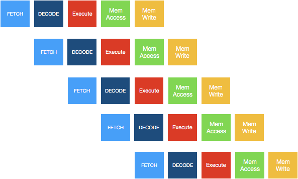
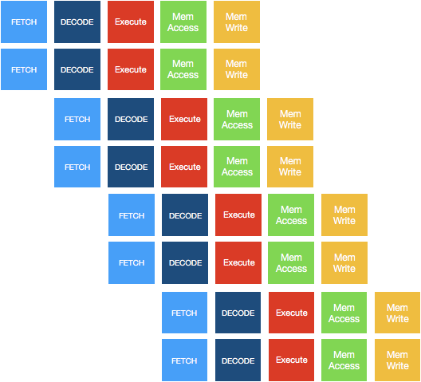
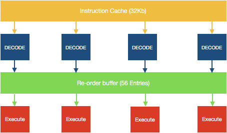
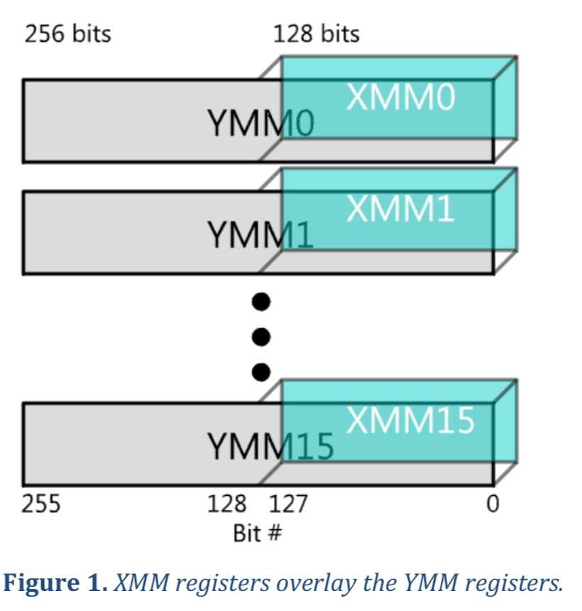
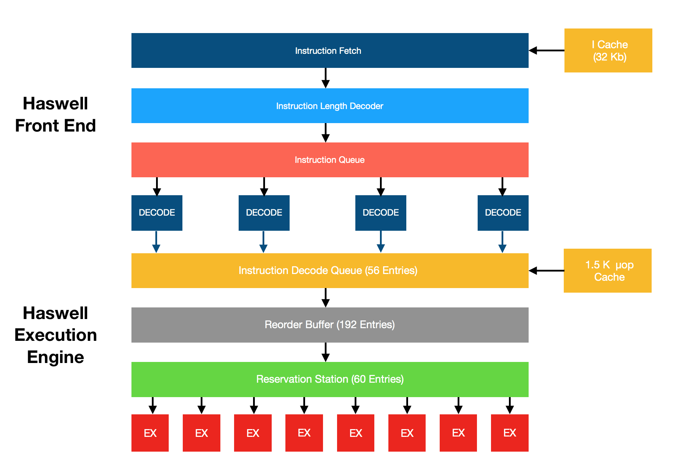
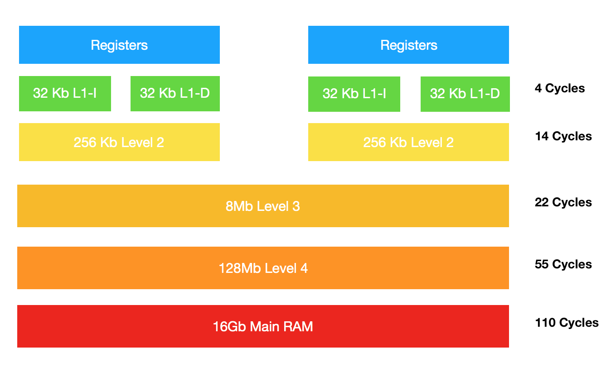
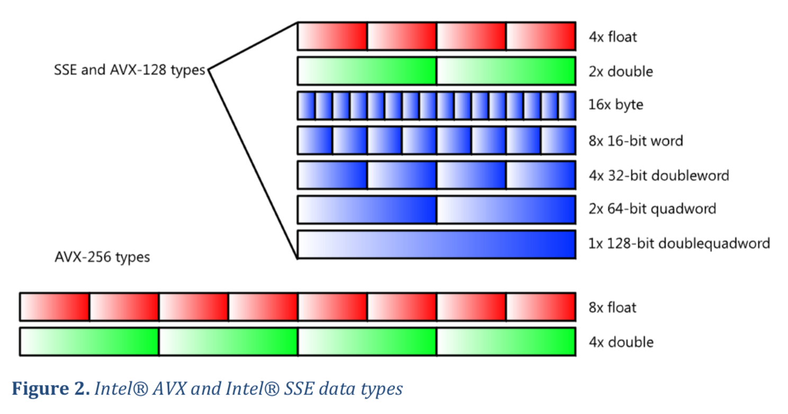
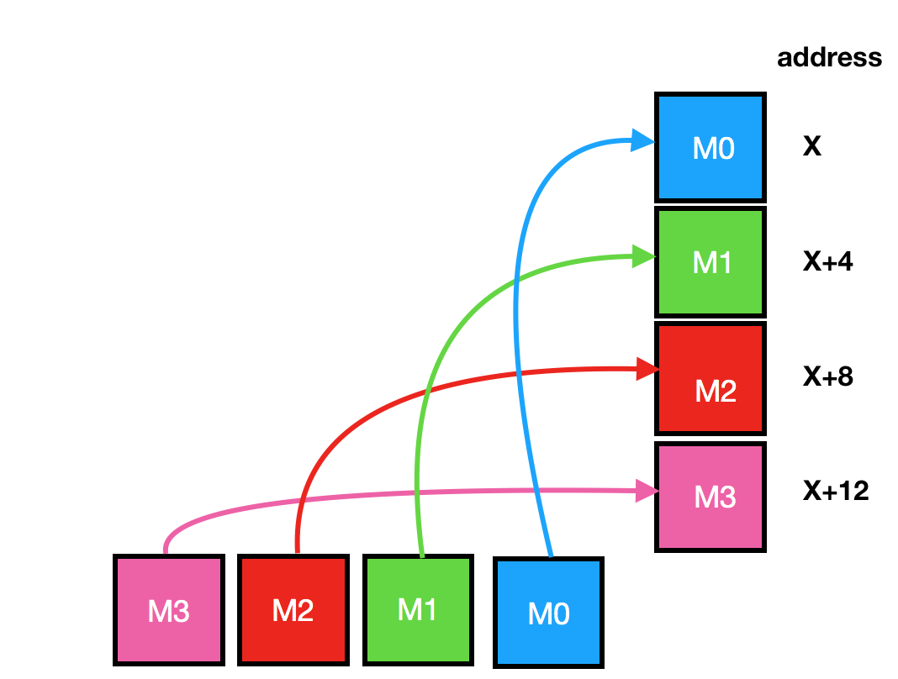
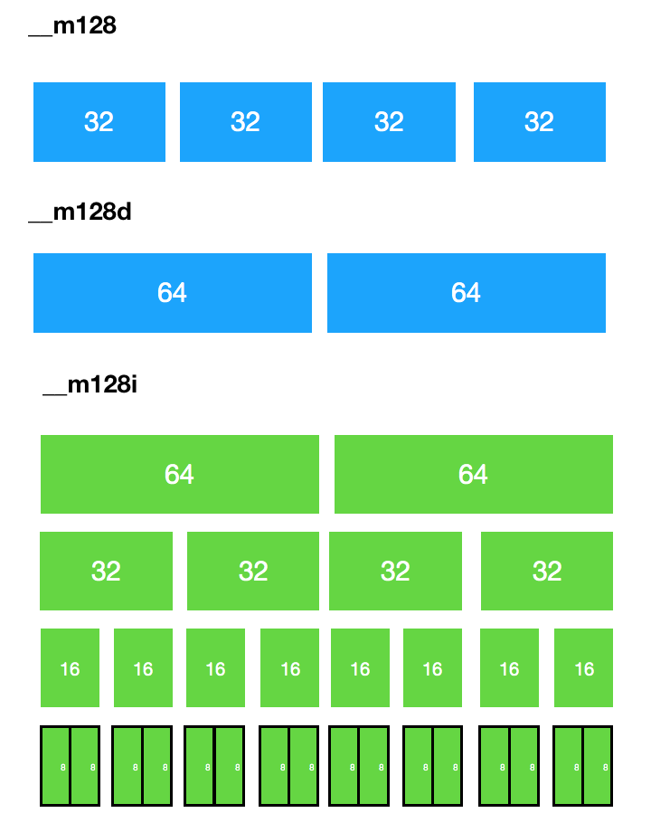
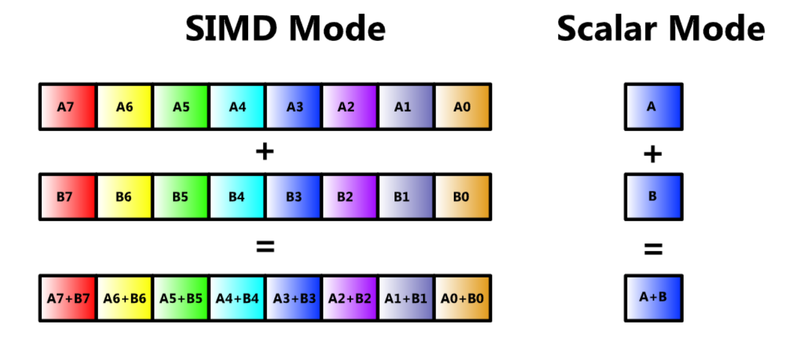

# Introduction to SIMD

Rob Bateman & Jon Macey

jmacey@bournemouth.ac.uk

---

## Single Instruction, Multiple Data (SIMD)
- A machine in which each instruction is applied on a collection of items (data).
- [Vector processors](https://en.wikipedia.org/wiki/Vector_processor) were the very first machines that followed this paradigm.
- GPU's also follow this design at the level of the [streaming multi-processor](https://en.wikipedia.org/wiki/Stream_processing). 
- nVidia and AMD both use these but with different names (SM vs SIMD)
- But first some History of CPU architecture.

--

## Intel MMX
- 8 independently addressable 64bit MMX registers
- Integer SIMD units only ( not very useful!)
- MMX and FPU stack shared the same register space
- Costly to switch between MMX and FPU
- A technology that was hyped extensively, but used very little!

--

## AMD 3D Now
- Extended MMX by adding the ability to do 2 FPU ops in parallel
- Few games developers cared! (AMD chips were better, but Intel was
the premium product that had market share!)
- However, Graphics Card vendors (e.g. 3dfx, nvidia, ATI, matrox) all provided optimised drivers that utilised it.
- Also found optimised codepaths in DirectX6

--

## SSE
- Streaming SIMD Extensions (SSE) is a Single Instruction Multiple Data instruction set introduced by Intel in 1999.
- The original SSE contains 70 new instructions, most of which work on single precision floating point data. 
- SIMD instructions can greatly increase performance when exactly the same operations are to be performed on multiple data objects. 

--

## SSE

- 8 independently addressable 128 bit vector units (floating point only!)
- Intended to replace x87 completely via ‘SS’ instructions
- Added the packed-single (PS) instructions (try to use as fast)
- Later extended with SSE2 to add integer support (notable that Intel now prioritized float over int!) 

--

## SIMD Vector Units
- Intel MMX – 64bit integer only SIMD 
- AMD 3D Now! – 64bit floating point (Direct X6, Voodoo drivers, etc) • - Intel SSE – 128bit floating point
- Intel SSE2 -> SSE4 – 128bit integer units
- AMD SSE5 (and others) – FMA support, and some other stuff
- Intel AVX – 256bit float
- Intel AVX2 – 256bit integer
- Intel AVX512 – 512bit (Not common yet)

---

## [A bit of CPU revision](https://en.wikipedia.org/wiki/Instruction_cycle)

- The instruction cycle for a CPU is usually denoted by the following commands
  - FETCH – read instruction from memory
  - DECODE – set up the ALU to execute correct instruction 
  - EXECUTE – do the actual work
  - MEM ACCESS – possible data read
  - WRITE-BACK – write result back to memory

--

## What a waste

</img>
- This is a classic single pipeline / RISC architecture
- 5 clock cycles per instruction
- but CPU only doing work 20% of the time

--

## Pipelining
</img>


--

## Pipelining

- Pipelining  improves IPC (instructions per clock)
- Possible to get [Pipeline Bubbles](https://tinyurl.com/y6vo2kqa) :
- If the execute step took more than 1 cycle (e.g. division, sqrt, etc!)
  - The next instruction depends on a result from the previous instruction
- Conditional Jump Statements:
  - If/else statements. How can you continue until you know the result of the condition?

--

## Super-scalar Pipelines

</img>

--

## Super-scalar Pipelines
- Introduce a second ALU and Control Unit
- Process two instructions per clock, instead of 1.
- Pentium 1:
  - U pipe – primary
  - V pipe – secondary (could only perform a limited set of ops)
- Interleaving Instructions was paramount to gaining performance
- Possible to now stall both pipes!

--

## Out of Order Execution ([OOOE](https://en.wikipedia.org/wiki/Out-of-order_execution))

- Up until now, we’ve been looking at in-order CPU’s
- Careful instruction ordering was needed in order to keep both the U
& V pipes busy (of the Pentium 1)

- If we want to have more than 2 execution units (ALUs), ordering instructions is important! (code compiled for a UV piped architecture would require a re-compile to make use of 4 execution units)
- Pentium Pro / Pentium II / Pentium III took new approach

--

## OOOE (simplified)

</img>

--

## Registers
- Modern Intel CPUs have 168 general purpose registers, and 168 YMM registers.

</img>

--

## Registers

- These are dynamically assigned to the named registers (e.g. YMM0 -> YMM15) for individual chains of instructions
- AVX uses sixteen YMM registers. Each YMM register contains:
  - eight 32-bit single-precision floating point numbers or
  - four 64-bit double-precision floating point numbers.

--

## [CISC](https://en.wikipedia.org/wiki/Complex_instruction_set_computer)
- Complex Instruction Set
  - A very descriptive machine code language
  - High code density
  - Handling complex instructions, requires complex circuitry

--

## [RISC](https://en.wikipedia.org/wiki/Reduced_instruction_set_computer)
- Reduced Instruction Set
  - Fewer number of simpler instructions
  - Simpler circuitry for simpler instructions, can be made to go faster
  - Low code density

--

## Modern Hardware

- Modern CPU's use a combination of both
  - Macro Ops : The machine code instructions
  - Micro Ops : The simpler internal RISC instructions


```
# ASM 
ADDPS YMM0 YMM0 [RCX+4] 
# RISC
ADD RDX RCX 4 
MOVPS YMM1 [RDX]
ADDPS YMM0 YMM0 YMM1
```

--

## Microcode

- Larger Macro Ops, are split into simpler to compute micro ops.
- The CPU Front End : the bit of the CPU that transforms macro ops into micro ops.
- The CPU Execution Unit: the bit of the CPU that executes the microcode.
- This translation from macro to micro takes time : 5 cycles

--

### [Haswell MicroArchitecture](https://en.wikichip.org/wiki/intel/microarchitectures/haswell) Simplified

</img>

--

## Haswell Stages
- Instruction Fetch – pull code from the Instruction Cache
- Instruction Length Decode – determine how long each instruction is
- Instruction Queue – the instructions that are waiting to be decoded
- Decode 
  – 3 super simple decoders,  
  - 1 that handles complex instructions
  -  Don’t issue a million sqrt’s in a row!

--

## Haswell Stages

- Instruction Decode Queue
  - small buffer that holds instructions as they are being decoded 
  - may take a few clocks!
- Reorder Buffer 
  - which instructions can be extracted first?
- Reservation Station 
  - the instructions ready to be executed!

--

## µOP Cache
-  If the instructions exist in the µop cache, the front end is powered down.
  - Saves power
  - Increases battery life
  - Shortens execution pipeline by 5 clocks (approx. 27% performance improvement over a full decode)

--

## [Hyper Threading](https://en.wikipedia.org/wiki/Hyper-threading)
- A single thread might not be able to make full use of all the execution units at any given time
  - Code may have dependency chains 
  - Code may not be needing the FPU

--

## Hyper Threading
-  Allowing 2 threads to run on a single core may improve performance - Assumes both threads are using different parts of the CPU
  - Typically not a 100% performance improvement, 5% -> 30% is more likely!
  - Requires that the CPU supports OOOE and register renaming
  - Instruction Fetch needs to pull in 2 streams of instructions

---

## [CPU Cache](https://en.wikipedia.org/wiki/CPU_cache)
- Read and re-read ["What Every Programmer Should Know about Memory"](https://www.akkadia.org/drepper/cpumemory.pdf) 
- This is old (2007) but still mostly relevant to modern hardware.
- See discussion [here](https://stackoverflow.com/questions/8126311/what-every-programmer-should-know-about-memory) for more detail of modern hardware changes.

--

## [CPU Cache](https://en.wikipedia.org/wiki/CPU_cache)

- Cache Levels organised in a hierarchy, from fastest to slowest
- Intel SkyLake-R 
  - 168 General Purpose Registers
  - 168 YMM registers
  - 32Kb L1 instruction cache
  - 32Kb L1 data cache
  - 1.5K entry µop cache
  - 256Kb L2 data cache
  - 8Mb L3 data cache (shared between cores)
  - 128Mb L4 data eDRAM cache (shared between cores + onboard GPU)

--

## Cache

</img>

--

## Cache Misses

- If the data you need is not in the CPU cache, you have to wait for it to arrive from main memory.
- This is known as a cache miss!
- Cache misses can kill performance if they happen often enough.
- Use strategies to avoid wherever possible 

--

## [Hardware Pre-Fetching](https://en.wikipedia.org/wiki/Cache_prefetching)
- Most modern CPU’s contain specialised hardware that will analyse your memory access patterns, and attempt to load the data you need from main memory into the CPU cache *before* it is needed.
- Help the prefetcher!
  - [Forward Linear memory access](https://en.wikipedia.org/wiki/Memory_access_pattern#Linear) is good
  - Predictable memory patterns aren’t quite as good. 
  - Random memory access is discouraged!

--

## Cache Associativity
- Duplicating a memory value multiple times in the CPU cache can improve performance.
- However, keeping track of multiple instances of the same data, can hurt performance when writing to a value
- We may need to update 8 instances of the same value in the cache! 
- Choosing associativity levels for a CPU cache is a trade off
- Let the tools / CPU decide

--

## CPU Cache Lines
- A cache line is 64bytes in size
  - When a variable from memory is needed:
  - A 64byte aligned cache-line will be loaded into the L3 cache (or 2x64byte lines, if the variable straddles a cache line)
- It will be duplicated into the L2 cache
- And duplicated again in the L1 cache
- That value can finally be loaded from L1 into the register

--

## Why does this matter?
- take this (bad) code example

```
float sum(float v[], int BIG_NUM)
{
  float sum = 0;
  for(int i = 0; i < BIG_NUM; ++i)
  {
    sum += v[i]; 
  }
  return sum; 
}
```

--

## Add some parallel execution

```
float sum(float v[], int BIG_NUM)
{
  float sum = 0;
  #pragma omp parallel for
  for(int i = 0; i < BIG_NUM; ++i)
  {
    sum += v[i]; 
  }
  return sum; 
}
```
- Now we have a race condition 

--

## refactor

```
float sum(float v[], int BIG_NUM)
{
  float sums[NTHREADS] = {0}; 
  #pragma omp parallel 
  for for(int i = 0; i < BIG_NUM; ++i) 
  {
    sum[omp_get_thread_id()] += v[i]; 
  }
  float sum = 0;
  for(int i = 0; i < NTHREADS; ++i) 
    sum += sums[i];
  return sum;
}
```
- What problems could we  have now?

--

## problems?
- If NTHREADS is 16, then the size of the sums array is 64bytes. 
- How large is a cache line?
- So where will that 64byte sum array be stored?

--

## False Sharing
- This happens when a core writes to data that *happens* to exist in a cache line that has been loaded into another core.
- The penalty isn’t as bad as a cache miss, but it does have a cost!
- Where possible, strongly isolate memory writes made by each thread
- Similar issues exist with std::atomic, so use with caution!

---

## Using intrinsics

- Using the intrinsics is no different than using any other C/C++ library. 
- The programmer includes the correct header file for the type of intrinsic to be used, and then calls the desired intrinsic function. 

--

## intrinsics 
- all low-level SIMD operations are C Functions
- Each function maps to the corresponding SIMD (assembly) instruction
- SIMD intrinsics are platform dependent (different processors have different instruction) 

--

## intrinsics

- SIMD intrinsics are machine dependent but compiler independent
- Vector data types are machine independent but compiler dependent
- Need compiler flags

```
 -mfma -mavx2 -m64 -mf16c -O3 -ffast-math
```

- optimisation level is optional!
- ```-mf16c``` adds the float <-> half conversion intrinsics (alternative to ILM Half)

--

## Compile time checks 

- we can add this to any headers we use to check for the correct options

```
#ifdef _MSC_VER
// visual C++ only sets AVX2 flag :(
# ifndef __AVX2__
#  error Set the compile option:  /arch:AVX2   in project settings -> code generation -> enhanced instruction set
# endif
#else
# if !defined(__AVX2__) || !defined(__FMA__) || !defined(__F16C__)
#  error add the following to your compiler flags: -mavx2 -mfma -mf16c
# endif
#endif

```


--

## Headers

|Technology|	 Header file|
|----------|-------------|
| MMX™ technology	 |mmintrin.h|
| Streaming SIMD Extensions (SSE)|	 xmmintrin.h|
| Streaming SIMD Extensions 2 (SSE2)	| emmintrin.h|
| Itanium® Processor (native)	| ia64intrin.h|
| AVX2 | immintrin.h |
| getReg() and setReg()	| ia64regs.h |

--

## [Data types](https://software.intel.com/sites/default/files/m/d/4/1/d/8/Intro_to_Intel_AVX.pdf)
</img>

--

## Layout 

 </img>

--

## Sizes

</img>

--

## Types

- ```__m128``` Four single-precision floats
- ```__m128d``` Two double-precision floats
- ```__m128i``` 
  - Two 64-bit integers
  - Four 32-bit integers
  - Eight 16-bit integers
  - Sixteen 8-bit integers

--

## Why use these?

- In SIMD mode we do more operations per instruction

</img>

--

## [Instruction formats](https://computing.llnl.gov/tutorials/linux_clusters/Intro_to_Intel_AVX.pdf)

- Most Intel AVX intrinsic names follow the following format
```c++
_mm256_op_suffix(data_type param1, data_type param2, data_type param3) 
```

- where ```_mm256``` is the prefix for working on the new 256-bit registers;
- ```op``` is the operation name (such as add)
- ```_suffix``` denotes the kind of data to operate on

--

## suffix markings

| Marking | Meaning |
|---------|---------|
|[s/d] | Single- or double-precision floating point |
|[i/u]nnn  | Signed or unsigned integer of bit size nnn, where nnn is 128, 64, 32, 16, or 8 |
|[ps/pd/sd] | Packed single, packed double, or scalar double epi32 Extended packed 32-bit signed integer |
| si256 | Scalar 256-bit integer |

--

## Data Types

|Type |Meaning|
|-----|-------|
| __m256 | 256-bit as eight single-precision floating-point (fp) values, representing a YMM register or memory location |
| __m256d | 256-bit as four double-precision fp values, representing a YMM register or memory location |
| __m256i | 256-bit as integers, (bytes, words, etc.) |
| __m128 | 128-bit single precision fp (32 bits each) |
| __m128d | 128-bit double precision fp (64 bits each) |

---

## SSE3
- to start with we will use SSE3 (and raw intrinsics code)
- this covers most of the basics and is easier to understand
- we will then move to SSE4 and AVX(2)
  - we will also re-factor code to make it nicer

--

## Memory Operations
- We need operations to load / store data to the ``__m128(d/i)`` data types
- These operations come in two types :-
  - [u (unaligned)](https://www.intel.com/content/dam/www/public/us/en/documents/manuals/64-ia-32-architectures-optimization-manual.pdf)
  - aligned
- Also have the ability to "r"everse the order.

--

## Memory Operations
- simple load from float array (note use of gtest)

```c++
TEST(SSE3,_mm_loadu_ps)
{
  float data[]={1.0f, 2.0f, 3.0f, 4.0f};
  __m128 a=_mm_loadu_ps(&data[0]);
  printf("result %f %f %f %f \n",a[0],a[1],a[2],a[3]);
  // Note Ordering
  ASSERT_FLOAT_EQ((a[0]),1.0f);
  ASSERT_FLOAT_EQ(a[1],2.0f);
  ASSERT_FLOAT_EQ(a[2],3.0f);
  ASSERT_FLOAT_EQ(a[3],4.0f);
}
```

--

## Accessing Values
- Direct access to the elements will not compile on Win32 (the internals of registers are off limits, and are never specified, but they can never be accessed on the CPU). 
- Clang/gcc allow you to away with this, but Win32 will not.

--

## Example

- Using this code

``` 
float getF0(__m128 a)
{
    return a[0];
}
float getF1(__m128 a)
{
    return a[1];
}
float getF2(__m128 a)
{
    return a[2];
}
float getF3(__m128 a)
{
    return a[3];
}
```

--

## Accessing Values

- Produces the following assembly:

```
; zero cost cast, or _mm_cvtss_f32 
getF0(float __vector(4)):
 ret    

; swizzle + cast  _mm_cvtss_f32( _mm_movehdup_ps(a) )
getF1(float __vector(4)):
 vmovshdup xmm0,xmm0
 ret    

; _mm_cvtss_f32( _mm_movehl_ps(a) )
getF2(float __vector(4)):
 vpermilpd xmm0,xmm0,0x1
 ret    

; _mm_cvtss_f32( _mm_permute_ps(a, 0xe7) )
getF3(float __vector(4)):
 vpermilps xmm0,xmm0,0xe7
 ret    
```

--

## Accessing Values

- Things get even nastier when you access elements 4 -> 7 in a __m256 (since it needs to do a 3 cycle permute128 prior the the code above). 
- The only safe way is this (still slow)

```
void print(__m128 a) 
{
  alignas(16) float f[4];
  _mm_store_ps(f, a);
  printf("%f %f %f %f", f[0], f[1], f[2], f[3]);
}
```


--

## Memory Operations
- set note the order of the data

```c++
TEST(SSE3,_mm_set_ps)
{
  __m128 a=_mm_set_ps(1.0f, 2.0f, 3.0f, 4.0f);
  // we can access vector elements directly (not recommneded due to alignment issues)

  printf("result %f %f %f %f \n",a[0],a[1],a[2],a[3]);
  // Note Ordering
  ASSERT_FLOAT_EQ((a[0]),4.0f);
  ASSERT_FLOAT_EQ(a[1],3.0f);
  ASSERT_FLOAT_EQ(a[2],2.0f);
  ASSERT_FLOAT_EQ(a[3],1.0f);
}
```

--

## Memory Operations
- setr note order of data

```c++
TEST(SSE3,setr_ps)
{
  __m128 a=_mm_setr_ps(1.0f, 2.0f, 3.0f, 4.0f);
  // note we can access the data by re-casting to float
  // again best not too
  float *r = reinterpret_cast<float*>(&a);

  std::cout<<"restult "<<r[0]<<' '<<r[1]<<' '<<r[2]<<' '<<r[3]<<'\n';
  // Note order of data (due to the (r)everse function )
  ASSERT_FLOAT_EQ(r[0],1.0f);
  ASSERT_FLOAT_EQ(r[1],2.0f);
  ASSERT_FLOAT_EQ(r[2],3.0f);
  ASSERT_FLOAT_EQ(r[3],4.0f);

}
```

--

## Memory Operations

- can set all to zero
- note use of storeu_ps preferred way to access components

```c++
TEST(SSE3,setZero)
{
  // _mm_setzero_ps sets all elements to zero
  __m128 a=_mm_setzero_ps();
  // get result by using the storeu_ps is prefered
  float r[4];
  _mm_storeu_ps(r,a);
  std::cout<<"result "<<r[0]<<' '<<r[1]<<' '<<r[2]<<' '<<r[3]<<'\n';

  ASSERT_FLOAT_EQ(r[0],0.0f);
  ASSERT_FLOAT_EQ(r[1],0.0f);
  ASSERT_FLOAT_EQ(r[2],0.0f);
  ASSERT_FLOAT_EQ(r[3],0.0f);
}
```

--

## Memory Operations
- can "splat" same value across whole vector
- note use of storeu_ps preferred way to access components

```c++
TEST(SSE3,_mm_set1_ps)
{
  // _mm_set1_ps sets all elements to value passed (splat!)
  __m128 a=_mm_set1_ps(0.9991f);
  // get result by using the storeu_ps is prefered
  float r[4];
  _mm_storeu_ps(r,a);
  std::cout<<"result "<<r[0]<<' '<<r[1]<<' '<<r[2]<<' '<<r[3]<<'\n';

  ASSERT_FLOAT_EQ(r[0],0.9991f);
  ASSERT_FLOAT_EQ(r[1],0.9991f);
  ASSERT_FLOAT_EQ(r[2],0.9991f);
  ASSERT_FLOAT_EQ(r[3],0.9991f);

}
```

--

## ```_mm_add_ps```

- we can add 4 components in one operation

```c++
TEST(SSE3,_mm_add_ps)
{
  // load data into data type
  __m128 a=_mm_setr_ps(5, 6, 7, 8);
  __m128 b=_mm_setr_ps(1, 2, 3, 4);
  // execute an add
  __m128 res=_mm_add_ps(a, b);
  // get result by using
  float r[4];  
  _mm_storeu_ps(r,res);

  std::cout<<"add result "<<r[0]<<' '<<r[1]<<' '<<r[2]<<' '<<r[3]<<'\n';
  ASSERT_FLOAT_EQ(r[0],6);
  ASSERT_FLOAT_EQ(r[1],8);
  ASSERT_FLOAT_EQ(r[2],10);
  ASSERT_FLOAT_EQ(r[3],12);
}
```

--

## ```_mm_add_ss```
- this operation adds only the lowest component and passes through the rest

```c++
TEST(SSE3,_mm_add_ss)
{
  // load data into data type
  __m128 a=_mm_setr_ps(5, 6, 7, 8);
  __m128 b=_mm_setr_ps(1, 2, 3, 4);
  // execute an add on only the lowest bit (5 + 1) in this case
  __m128 res=_mm_add_ss(a, b);
  // get result by using
  float r[4];
  _mm_storeu_ps(r,res);

  std::cout<<"result "<<r[0]<<' '<<r[1]<<' '<<r[2]<<' '<<r[3]<<'\n';
  ASSERT_FLOAT_EQ(r[0],6);
  ASSERT_FLOAT_EQ(r[1],6);
  ASSERT_FLOAT_EQ(r[2],7);
  ASSERT_FLOAT_EQ(r[3],8);
}
```

--

## arithmetic operations
- There are also corresponding arithmetic operations for add, mul and divide
- these come in single and vector versions, the a components not being used pass through

```
__m128 res = _mm_sub_ps(a,b); // subtract vector
__m128 res = _mm_sub_ss(a,b); // subtract lowest pass through rest
__m128 res = _mm_mul_ps(a,b); // multiply vector
__m128 res = _mm_mul_ss(a,b); // multiply lowest pass through rest
__m128 res = _mm_div_ps(a,b); // divide vector
__m128 res = _mm_div_ss(a,b); // divide lowest pass through rest
```

--

## ```_mm_rcpps_ps```
- 1/x for each vector component (also ss variant)

```c++
TEST(SSE3,_mm_rcpps_ps)
{
  // create a 4 float vector
  __m128 a=_mm_setr_ps(1.0f, 2.0f, 3.0f, 4.0f);
  // evauate 1/a for each vector component
  auto r1 = _mm_rcp_ps(a);
  float r[4];
  _mm_store_ps(r,r1);
  // should set all values to inf
  std::cout<<"result "<<r[0]<<' '<<r[1]<<' '<<r[2]<<' '<<r[3]<<'\n';
  EXPECT_NEAR(r[0],1.0f/1.0f,0.001);
  EXPECT_NEAR(r[1],1.0f/2.0f,0.001);
  EXPECT_NEAR(r[2],1.0f/3.0f,0.001);
  EXPECT_NEAR(r[3],1.0f/4.0f,0.001);
}
```

--

## [Note](https://randomascii.wordpress.com/2012/04/21/exceptional-floating-point/)

- One thing to be aware of is that instructions like reciprocal estimate (rcpps) never trigger divide-by-zero exceptions 
- they just silently generate infinity. 
-  Additionally, many common patterns for SIMD instructions only use some components of the four-wide registers. 
- This could be because the code is operating on a three-float vector, or it could be because the code is operating on an array of floats that is not a multiple of four long. 
- These exceptions are false-positives (they don’t indicate a bug)

--

## ```_mm_max_ps```

- we can place min or max into a result vector (also ss)

```c++
TEST(SSE3,_mm_max_ps)
{
  // create a 3 float vector
  __m128 a=_mm_setr_ps(1.0f, 9.0f, 3.0f, 3.0f);
  __m128 b=_mm_setr_ps(2.0f, 5.0f, 6.0f, 4.0f);
  // evauate 1/a for each vector component
  auto r1 = _mm_max_ps(a,b);
  float r[4];
  _mm_store_ps(r,r1);
  // should set all values to inf
  std::cout<<"result "<<r[0]<<' '<<r[1]<<' '<<r[2]<<' '<<r[3]<<'\n';
  ASSERT_FLOAT_EQ(r[0],2.0f);
  ASSERT_FLOAT_EQ(r[1],9.0f);
  ASSERT_FLOAT_EQ(r[2],6.0f);
  ASSERT_FLOAT_EQ(r[3],4.0f);
}
```

--

## Vector Length 

```c++
TEST(SSE3,length)
{
  // create a 3 float vector with last component 0
  __m128 a=_mm_setr_ps(1.0f, 2.0f, 3.0f, 0.0f);
  // multiply a*a
  auto r1 = _mm_mul_ps(a, a);
  float r[4];
  _mm_store_ps(r,r1);
  // should set all values to inf
  std::cout<<"mul "<<r[0]<<' '<<r[1]<<' '<<r[2]<<' '<<r[3]<<'\n';
  // The haddps instruction performs a horizontal add, meaning that
  // adjacent elements in the same operand are added together.
  // The result of the operation on operand a (A3, A2, A1, A0) and
  //operand b  (B3, B2, B1, B0)
  // is (B3 + B2, B1 + B0, A3 + A2, A1 + A0).
  auto r2 = _mm_hadd_ps(r1, r1);
  _mm_store_ps(r,r2);
  // should set all values to inf
  std::cout<<"hadd1 "<<r[0]<<' '<<r[1]<<' '<<r[2]<<' '<<r[3]<<'\n';

  auto r3 = _mm_hadd_ps(r2, r2);
  _mm_store_ps(r,r3);
  // should set all values to inf
  std::cout<<"hadd1 "<<r[0]<<' '<<r[1]<<' '<<r[2]<<' '<<r[3]<<'\n';
  // now we are going to use _mm_cvtss_f32 to extract the lower order floating point
  // value from the parameter.
  // Which we have called _mm_sqrt_ss which computes the square root of the lower single-precision FP value of a
  // the upper three single-precision FP values are passed through.
  float length= _mm_cvtss_f32(_mm_sqrt_ss(r3));
  std::cout<<"length is "<<length<<'\n';
  EXPECT_NEAR(length,3.7416f,0.001f);
}

```

---

## Let's make the code nicer
- One of the issues with SSE / AVX code are the number of underscores
- also types are a bit confusing.
- we should re-factor / typedef our code to make it easier to read
- see [this](https://github.com/AnimalLogic/AL_USDMaya/blob/master/lib/AL_USDMaya/AL/maya/SIMD.h) for a good example


--

## Types
- note this is c++ 11 so if needed for c use typedef

```c++
#include <immintrin.h>

// SSE3/4 types AVX128
using f128=__m128; // float[4]
using i128=__m128i; // int64[2], int32[4], etc
using d128=__m128d; // double[2]
// AVX2 types AVX256
using  f256=__m256; // float[8]
using  i256=__m256i; // int64[4], int32[8], etc
using  d256=__m256d; // double[4]

#ifdef __AVX512F__
  // AVX 512 (may not be supported on all chips)
  using  f512=__m512; // float[16]
  using  i512=__m512i; // int64[8], int32[16], etc 
  using  d512=__m512d; // double[8]
#endif
```

--

## Lets make testing easier
- Most of the test will require repetative code so write functions

```c++
enum class TestModef  {FLOATEQ,NEAR};
struct TestResultF
{
  TestResultF(float _r) : expected(_r){}
  TestResultF(float _r, TestModef _mode) : expected(_r),mode(_mode){}
  float expected;
  TestModef mode=TestModef::FLOATEQ;
};

```

--

## ```testAndReport4f```

```c++
void testAndReport4f(const f128 v, std::initializer_list<TestResultF> testResults)
{
  float res[4];
  store4f(res,v);
  std::cout<<"result ["<<res[0]<<' '<<res[1]<<' '<<res[2]<<' '<<res[3]<<"]\n";
  size_t index=0;
  for(auto t : testResults)
  {
    switch (t.mode)
    {
      case TestModef::FLOATEQ :
        ASSERT_FLOAT_EQ(v[index++],t.expected);
      break;
      case TestModef::NEAR :
        ASSERT_NEAR(v[index++],t.expected,0.001f);
      break;
    }
  }
}
```

--

## ```store4f```
- The simd.h header is going to wrap up the functions we need
- Unit tests are provided to check for correct results

```c++
// store

inline void store4f(void* const ptr, const f128 reg)
{
  _mm_store_ps(static_cast<float *>(ptr), reg);
}

inline void store8f(void* const ptr, const f256 reg)
{
  _mm256_store_ps(static_cast<float *>(ptr), reg);
}

inline void store4i(void* const ptr, const i128 reg)
{
  _mm_store_si128(static_cast<i128*>(ptr), reg);
}
inline void store2d(void* const ptr, const d128 reg)
{
  _mm_store_pd(static_cast<double*>(ptr), reg);
}

inline void storeu4f(void* const ptr, const f128 reg) 
{ 
  _mm_storeu_ps(static_cast<float *>(ptr), reg);
}
inline void storeu4i(void* const ptr, const i128 reg) 
{ 
  _mm_storeu_si128(static_cast<i128*>(ptr), reg);
}

inline void storeu2d(void* const ptr, const d128 reg) 
{ 
  _mm_storeu_pd(static_cast<double *>(ptr), reg);
}
```

--

## load[u]4f

```c++
TEST(SSE4,loadu4f)
{
  float data[]={1.0f, 2.0f, 3.0f, 4.0f};
  f128 a=loadu4f(&data[0]);
  // Note Ordering
  testAndReport4f(a,{{1.0f},{2.0f},{3.0f},{4.0f}});
}
TEST(SSE4,load4f)
{
  float data[]={1.0f, 2.0f, 3.0f, 4.0f};
  f128 a=load4f(&data[0]);
  testAndReport4f(a,{{1.0f},{2.0f},{3.0f},{4.0f}});
}

```

```
result [1 2 3 4]
result [1 2 3 4]
```

--

## ```set4f```

``` c++
TEST(SSE4,set4f)
{
  f128 a=set4f(1.0f, 2.0f, 3.0f, 4.0f);
  testAndReport4f(a,{{1.0f},{2.0f},{3.0f},{4.0f}});
}
```

```
result [1 2 3 4]
```

--

## splat and zero

```c++ 
inline f128 zero4f() { return _mm_setzero_ps(); }
inline f128 splat4f(float f) { return _mm_set1_ps(f); }
```
```c++
TEST(SSE4,zero4f)
{
  f128 a=zero4f();
  testAndReport4f(a,{{0.0f},{0.0f},{0.0f},{0.0f}});
}

TEST(SSE4,splat4f)
{
  f128 a=splat4f(0.9991f);
  testAndReport4f(a,{{0.9991f},{0.9991f},{0.9991f},{0.9991f}});
}
```

--

## arithmetic

```c++
inline f128 mul4f(const f128 a, const f128 b) { return _mm_mul_ps(a, b); }
inline f128 add4f(const f128 a, const f128 b) { return _mm_add_ps(a, b); }
inline f128 sub4f(const f128 a, const f128 b) { return _mm_sub_ps(a, b); }
inline f128 div4f(const f128 a, const f128 b) { return _mm_div_ps(a, b); }

```
```c++
TEST(SSE4,add4f)
{
  // load data into data type
  f128 a=set4f(5, 6, 7, 8);
  f128 b=set4f(1, 2, 3, 4);
  // execute an add
  f128 res=add4f(a, b);
  testAndReport4f(res,{{6.0f},{8.0f},{10.0f},{12.0f}});
}

TEST(SSE4,sub4f)
{
  f128 a=set4f(5, 6, 7, 8);
  f128 b=set4f(1, 2, 3, 4);
  f128 res=sub4f(a, b);
  testAndReport4f(res,{{4.0f},{4.0f},{4.0f},{4.0f}});
}

TEST(SSE4,mul4f)
{
  f128 a=set4f(1.0f, 2.0f, 3.0f, 4.0f);
  f128 b=splat4f(0.5f);
  f128 res=mul4f(a, b);
  testAndReport4f(res,{{0.5f},{1.0f},{1.5f},{2.0f}});
}

TEST(SSE4,div4f)
{
  f128 a=set4f(1.0f, 2.0f, 3.0f, 4.0f);
  f128 b=splat4f(2.0f);
  f128 res=div4f(a, b);
  testAndReport4f(res,{{0.5f},{1.0f},{1.5f},{2.0f}});
}
```

--

## division by zero

```c++
TEST(SSE4,divZero)
{
  // test to see what division by zero does
  f128 a=set4f(1.0f, 2.0f, 3.0f, 4.0f);
  f128 b=splat4f(0.0f);
  f128 res=div4f(a, b);
  float r[4];
  store4f(r,res);
  // should set all values to inf
  std::cout<<"result "<<r[0]<<' '<<r[1]<<' '<<r[2]<<' '<<r[3]<<'\n';
  ASSERT_TRUE (isinf(r[0]));
  ASSERT_TRUE (isinf(r[1]));
  ASSERT_TRUE (isinf(r[2]));
  ASSERT_TRUE (isinf(r[3]));
}
```

--

## Division by zero
- note under max OSX isinf is generated in this example
- under linux whilst it prints out inf, isinf (and [fpclassify](http://www.cplusplus.com/reference/cmath/fpclassify/)) report a normal number
- this is due to differences in how the -ffast-math flag works 
- For more details on floating point read ["What Every Computer Scientist Should Know About Floating-Point Arithmetic
"](https://docs.oracle.com/cd/E19957-01/806-3568/ncg_goldberg.html
)

--

## ```_mm_dp_ps```

```c++
enum class DotMask
{
  None = 0,
  X = 0x1,
  Y = 0x2,
  Z = 0x4,
  W = 0x8,
  XY = X | Y,
  XZ = X | Z,
  XW = X | W,
  YZ = Y | Z,
  YW = Y | W,
  ZW = Z | W,
  XYZ = X | Y | Z,
  XYW = X | Y | W,
  XZW = X | Z | W,
  YZW = Y | Z | W,
  XYZW = X | Y | Z | W
};


template<DotMask inmask, DotMask outmask>
inline f128 dot4f(const f128 a, const f128 b)
{
  constexpr uint8_t mask = static_cast<uint8_t>(outmask) | (static_cast<uint8_t>(inmask) << 4);
  return _mm_dp_ps(a, b, mask);
}

template< int8_t mask>
inline f128 dot4f(const f128 a, const f128 b)
{
  return _mm_dp_ps(a, b, mask);
}

```

--

## dot product mask

```
int main ()
{
/*
Mask layout
01234567
abcdefgh

tmp0 := (mask4 == 1) ? (a0 * b0) : +0.0 (d)
tmp1 := (mask5 == 1) ? (a1 * b1) : +0.0 (c)
tmp2 := (mask6 == 1) ? (a2 * b2) : +0.0 (b)
tmp3 := (mask7 == 1) ? (a3 * b3) : +0.0 (a)

tmp4 := tmp0 + tmp1 + tmp2 + tmp3

r0 := (mask0 == 1) ? tmp4 : +0.0  (e)
r1 := (mask1 == 1) ? tmp4 : +0.0  (f)
r2 := (mask2 == 1) ? tmp4 : +0.0  (g)
r3 := (mask3 == 1) ? tmp4 : +0.0  (h)
*/
  f128 a=set4f(1.0f,2.0f,3.0f,4.0f);
  f128 b=set4f(0.5f,1.5f,2.5f,3.5f);
  f128 c;
  float r[4];
  // result is  0.5 3.0 7.5 14.0
  // note c++ 14 binary literal may not work everywhere
  const int all =0b11111111;
  const int u1  =0b10001111;
  const int u2  =0b01001111;
  const int u3  =0b00101111;
  const int u4  =0b00011111;
  
  std::cout<<"bin "<<std::bitset<8>(all)<<' '<<all<<'\n';
  c= _mm_dp_ps(a,b,all);
  storeu4f(r,c);
  std::cout<<"result "<<r[0]<<' '<<r[1]<<' '<<r[2]<<' '<<r[3]<<'\n'; 

  std::cout<<"bin "<<std::bitset<8>(u1)<<' '<<u1<<'\n';
  c= _mm_dp_ps(a,b,u1);
  storeu4f(r,c);
  std::cout<<"result "<<r[0]<<' '<<r[1]<<' '<<r[2]<<' '<<r[3]<<'\n'; 

  std::cout<<"bin "<<std::bitset<8>(u2)<<' '<<u2<<'\n';
  c= _mm_dp_ps(a,b,u2);
  storeu4f(r,c);
  std::cout<<"result "<<r[0]<<' '<<r[1]<<' '<<r[2]<<' '<<r[3]<<'\n'; 

  std::cout<<"bin "<<std::bitset<8>(u3)<<' '<<u3<<'\n';
  c= _mm_dp_ps(a,b,u3);
  storeu4f(r,c);
  std::cout<<"result "<<r[0]<<' '<<r[1]<<' '<<r[2]<<' '<<r[3]<<'\n'; 

  std::cout<<"bin "<<std::bitset<8>(u4)<<' '<<u4<<'\n';
  c= _mm_dp_ps(a,b,u4);
  storeu4f(r,c);
  std::cout<<"result "<<r[0]<<' '<<r[1]<<' '<<r[2]<<' '<<r[3]<<'\n'; 

  // masks for lower order (result)
  const int c1  =0b11111000;
  const int c2  =0b11110100;
  const int c3  =0b11110010;
  const int c4  =0b11110001;
  
  std::cout<<"bin "<<std::bitset<8>(c1)<<' '<<c1<<'\n';
  c= _mm_dp_ps(a,b,c1);
  storeu4f(r,c);
  std::cout<<"result "<<r[0]<<' '<<r[1]<<' '<<r[2]<<' '<<r[3]<<'\n'; 

  std::cout<<"bin "<<std::bitset<8>(c2)<<' '<<c2<<'\n';
  c= _mm_dp_ps(a,b,c2);
  storeu4f(r,c);
  std::cout<<"result "<<r[0]<<' '<<r[1]<<' '<<r[2]<<' '<<r[3]<<'\n'; 

  std::cout<<"bin "<<std::bitset<8>(c3)<<' '<<c3<<'\n';
  c= _mm_dp_ps(a,b,c3);
  storeu4f(r,c);
  std::cout<<"result "<<r[0]<<' '<<r[1]<<' '<<r[2]<<' '<<r[3]<<'\n'; 

  std::cout<<"bin "<<std::bitset<8>(c4)<<' '<<c4<<'\n';
  c= _mm_dp_ps(a,b,c4);
  storeu4f(r,c);
  std::cout<<"result "<<r[0]<<' '<<r[1]<<' '<<r[2]<<' '<<r[3]<<'\n'; 
  return EXIT_SUCCESS;
}

```

--

## ```dot4f```

```c++
TEST(SSE4,length)
{
  // create a 3 float vector with last component 0
  f128 a=set4f(1.0f, 2.0f, 3.0f, 0.0f);
  float length=convertf32(sqrt1f(dot4f<DotMask::XYZW,DotMask::XYZW>(a, a )));

  std::cout<<"length is "<<length<<'\n';
  EXPECT_NEAR(length,3.7416f,0.001f);
}

TEST(SSE4,dot4f)
{
  // create a 3 float vector with last component 0
  f128 a=set4f(1.0f, 2.0f, 3.0f, 0.0f);

  float length=convertf32(sqrt1f(dot4f<117>(a, a )));

  std::cout<<"length is "<<length<<'\n';
  EXPECT_NEAR(length,3.7416f,0.001f);
}
```

--

## ```reciprocal4f```

```c++
inline f128 reciprocal4f(const f128 a)
{
  return _mm_rcp_ps(a);
}
```

```c++
TEST(SSE4,reciprocal4f)
{
  // create a 4 float vector
  f128 a=set4f(1.0f, 2.0f, 3.0f, 4.0f);
  // evauate 1/a for each vector component
  f128 res = reciprocal4f(a);
  testAndReport4f(res,{{1.0f/1.0f,TestModef::NEAR},
                       {1.0f/2.0f,TestModef::NEAR},
                       {1.0f/3.0f,TestModef::NEAR},
                       {1.0f/4.0f,TestModef::NEAR}});

}
```

--

## ```negate4f```

- we can use math tricks to do more complex operations

```c++
inline f128 negate4f(const f128 a)
{
  return _mm_sub_ps(_mm_set1_ps(0.0f), a);
}
```

```c++
TEST(SSE4,negate)
{
  f128 a=set4f(1.0f, 9.0f, 3.0f, 3.0f);
  f128 res=negate4f(a);
  testAndReport4f(res,{{-1.0f},{-9.0f},{-3.0f},{-3.0f}});
}
```

--

## sqrt functions

```c++
// sqrt lowest register pass rest
inline f128 sqrt1f(const f128 a)
{
  return _mm_sqrt_ss(a);
}

// 1/sqrt lowest register pass rest
inline f128 rsqrt1f(const f128 a)
{
  return _mm_rsqrt_ss(a);
}

inline f128 sqrt4f(const f128 a)
{
  return _mm_sqrt_ps(a);
}

inline f128 rsqrt4f(const f128 a)
{
  return _mm_rsqrt_ps(a);
}
```

--

## sqrt

```c++
TEST(SSE4,sqrt1f)
{
  f128 a={100.0f,25.0f,144.0f,2.0f};
  f128 res=sqrt1f(a);
  testAndReport4f(res,{{10.0f},{25.0f},{144.0f},{2.0}});
}

TEST(SSE4,rsqrt1f)
{
  f128 a={100.0f,25.0f,144.0f,2.0f};
  f128 res=rsqrt1f(a);
  testAndReport4f(res,{{1.0f/sqrt(100.0f),TestModef::NEAR},{25.0f},{144.0f},{2.0}});
}


TEST(SSE4,sqrt4f)
{
  f128 a={100.0f,25.0f,144.0f,2.0f};
  f128 res=sqrt4f(a);
  testAndReport4f(res,{{10.0f},{5.0f},{12.0f},{1.4141f,TestModef::NEAR}});
}

TEST(SSE4,rsqrt4f)
{
  f128 a={100.0f,25.0f,144.0f,2.0f};
  f128 res=rsqrt4f(a);
  testAndReport4f(res,{{1.0f/sqrtf(100.0),TestModef::NEAR},
                       {1.0f/sqrtf(25.0f),TestModef::NEAR},
                       {1.0f/sqrtf(144.0f),TestModef::NEAR},
                       {1.0f/sqrtf(2.0f),TestModef::NEAR}});
}

```

--

## min / max

```c++
inline f128 max4f(const f128 a, const f128 b)
{
  return _mm_max_ps(a,b);
}

inline f128 min4f(const f128 a, const f128 b)
{
  return _mm_min_ps(a,b);
}
```

```c++
TEST(SSE4,max)
{
  f128 a=set4f(1.0f, 9.0f, 3.0f, 3.0f);
  f128 b=set4f(2.0f, 5.0f, 6.0f, 4.0f);
  f128 res = max4f(a,b);
  testAndReport4f(res,{{2.0f},{9.0f},{6.0f},{4.0f}});
}
TEST(SSE4,min)
{
  f128 a=set4f(1.0f, 9.0f, 3.0f, 3.0f);
  f128 b=set4f(2.0f, 5.0f, 6.0f, 4.0f);
  f128 res=min4f(a,b);
  testAndReport4f(res,{{1.0f},{5.0f},{3.0f},{3.0f}});
}
```

--

## Logical instructions

```c++
// boolean
inline f128 and4f(const f128 a, const f128 b) { return _mm_and_ps(a, b); }
inline f128 andnot4f(const f128 a, const f128 b) { return _mm_andnot_ps(a, b); }
inline f128 or4f(const f128 a, const f128 b) { return _mm_or_ps(a, b); }
inline f128 xor4f(const f128 a, const f128 b) { return _mm_xor_ps(a, b); }
```

```c++
TEST(SSE4,and4f)
{
  f128 a={1.0f,0.0f,1.0f,0.0f};
  f128 b={1.0f,0.0f,0.0f,1.0f};
  f128 res=and4f(a,b);
  testAndReport4f(res,{{1.0f},{0},{0},{0}});
}

TEST(SSE4,andnot4f)
{
  f128 a={1.0f,0.0f,1.0f,0.0f};
  f128 b={1.0f,0.0f,0.0f,1.0f};
  f128 res=andnot4f(a,b);
  testAndReport4f(res,{{0},{0},{0},{1.0f}});
}

TEST(SSE4,or4f)
{
  f128 a={1.0f,0.0f,1.0f,0.0f};
  f128 b={1.0f,0.0f,0.0f,1.0f};
  f128 res=or4f(a,b);
  testAndReport4f(res,{{1.0f},{0},{1.0f},{1.0f}});
}

TEST(SSE4,xor4f)
{
  f128 a={1.0f,0.0f,1.0f,0.0f};
  f128 b={1.0f,0.0f,0.0f,1.0f};
  f128 res=xor4f(a,b);
  testAndReport4f(res,{{0},{0},{1.0f},{1.0f}});
}
```

--

## comparison operations

- Each comparison intrinsic performs a comparison of a and b. 
- For the packed form, the four single-precision FP values of a and b are compared, and a 128-bit mask is returned. 
- For the scalar form, the lower single-precision FP values of a and b are compared, and a 32-bit mask is returned; the upper three single-precision FP values are passed through from a. 
- The mask is set to 0xffffffff for each element where the comparison is true and 0x0 where the comparison is false.

--

## comparison operators

```c++
// comparisons
inline i128 cmpeq4i(const i128 a, const i128 b) { return _mm_cmpeq_epi32(a, b); }
inline i128 cmpeq16i8(const i128 a, const i128 b) { return _mm_cmpeq_epi8(a, b); }
inline i128 cmplt16i8(const i128 a, const i128 b) { return _mm_cmplt_epi8(a, b); }
inline i128 cmpgt16i8(const i128 a, const i128 b) { return _mm_cmpgt_epi8(a, b); }

inline f128 cmpeq4f(const f128 a, f128 b){ return _mm_cmpeq_ps(a,b);}
inline f128 cmpeq1f(const f128 a, f128 b){ return _mm_cmpeq_ss(a,b);}
inline f128 cmpneq4f(const f128 a, f128 b){ return _mm_cmpneq_ps(a,b);}
inline f128 cmpneq1f(const f128 a, f128 b){ return _mm_cmpneq_ss(a,b);}

inline f128 cmplt4f(const f128 a, f128 b){ return _mm_cmplt_ps(a,b);}
inline f128 cmplt1f(const f128 a, f128 b){ return _mm_cmplt_ss(a,b);}
inline f128 cmplteq4f(const f128 a, f128 b){ return _mm_cmple_ps(a,b);}
inline f128 cmplteq1f(const f128 a, f128 b){ return _mm_cmple_ss(a,b);}

inline f128 cmpgt4f(const f128 a, f128 b){ return _mm_cmpgt_ps(a,b);}
inline f128 cmpgt1f(const f128 a, f128 b){ return _mm_cmpgt_ss(a,b);}
inline f128 cmpgteq4f(const f128 a, f128 b){ return _mm_cmpge_ps(a,b);}
inline f128 cmpgteq1f(const f128 a, f128 b){ return _mm_cmpge_ss(a,b);}
// todo add in the not versions of above at some stage

```

---

## AVX 2
- advanced Vector Extensions (AVX, also known as Sandy Bridge New Extensions)
- AVX2 expands most integer commands to 256 bits and introduces fused multiply-accumulate (FMA) operations. 
- AVX-512 expands AVX to 512-bit support 

--

## AVX 2
- AVX uses sixteen YMM registers. Each YMM register contains:
  - eight 32-bit single-precision floating point numbers or
  - four 64-bit double-precision floating point numbers.

--

## What not to do ..
- it may be tempting to do this

```c++
typedef f128 Vec3;   // [x,y,z,0]
typedef f128 Vec4;   // [x,y,z,w]
typedef f512 Matrix4x4; // float mat[16]
```

- but don't it is not efficient (as we will see in the next lecture)

--

## This is what we want to aim for...

- Data Oriented design

```c++
struct Vec3x8
{
  f256 x; // 8 x components
  f256 y; // 8 y components
  f256 z; // 8 z components
};
```

--

## Think in batches
- will fit cache better

```c++
struct Vec3x32
{
  f256 x[4]; 
  f256 y[4]; 
  f256 z[4];
};
```
- Doesen't fit OOP design well (Instead of class Box, think class BoxBatch )

--

## set8f
- similar to sse versions
``` c++
inline f256 set8f(const float _a, const float _b, const float _c, const float _d,
                    const float _e, const float _f, const float _g, const float _h)
{
  return _mm256_setr_ps(_a, _b, _c, _d,_e,_f,_g,_h);
}
```

- Note format the same (PS / SS ) just prefixed with _mm256

--

## [Fused Multiply and Add (FMA)](https://en.wikipedia.org/wiki/Multiply%E2%80%93accumulate_operation)
- SSE3 and above introduced FMA instructions
- A fast FMA can speed up and improve the accuracy of many computations that involve the accumulation of products
  - Dot product
  - Matrix multiplication
  - convolution
  - newtons method

--

## FMA in SIMD

```
 (a * b) + c
-(a * b) + c
 (a * b) – c
-(a * b) - c
```

- these come in add and sub versions as well as negate results

--

## FMA

```c++
inline f128 fnmadd4f(const f128 a, const f128 b, const f128 c)
{
  return _mm_fnmadd_ps(a,b,c);
}

inline f128 fmadd4f(const f128 a, const f128 b, const f128 c)
{
  return _mm_fmadd_ps(a,b,c);
}

inline f128 fnmsub4f(const f128 a, const f128 b, const f128 c)
{
  return _mm_fnmsub_ps(a,b,c);
}

inline f128 fmsub4f(const f128 a, const f128 b, const f128 c)
{
  return _mm_fmsub_ps(a,b,c);
}
```

--

## fma

```c++
TEST(AVX,fmad4f)
{
  // result = (a * b) + c
  f128 a={1.0f,2.0f,3.0f,4.0f};
  f128 b={0.5f,0.5f,0.5f,0.5f};
  f128 c={2.0f,2.0f,2.0f,2.0f};

  f128 res=fmadd4f(a,b,c);
  testAndReport4f(res,{{2.5f},{3.0f},{3.5f},{4.0f}});
}

TEST(AVX,fnmad4f)
{
  // result = -(a * b) - c
  f128 a={1.0f,2.0f,3.0f,4.0f};
  f128 b={0.5f,0.5f,0.5f,0.5f};
  f128 c={1.0f,1.0f,1.0f,1.0f};

  f128 res=fnmadd4f(a,b,c);
  testAndReport4f(res,{{0.5f},{0.0f},{-0.5f},{-1.0f}});
}


TEST(AVX,fmsub4f)
{
  // result = (a * b) - c
  f128 a={1.0f,2.0f,3.0f,4.0f};
  f128 b={0.5f,0.5f,0.5f,0.5f};
  f128 c={2.0f,2.0f,2.0f,2.0f};

  f128 res=fmsub4f(a,b,c);
  testAndReport4f(res,{{-1.5f},{-1.0f},{-0.5f},{0.0f}});
}

TEST(AVX,fnmsub4f)
{
  // result = -(a * b) - c
  f128 a={1.0f,2.0f,3.0f,4.0f};
  f128 b={0.5f,0.5f,0.5f,0.5f};
  f128 c={1.0f,1.0f,1.0f,1.0f};

  f128 res=fnmsub4f(a,b,c);
  testAndReport4f(res,{{-1.5f},{-2.0f},{-2.5f},{-3.0f}});
}

```

--

---

## References
